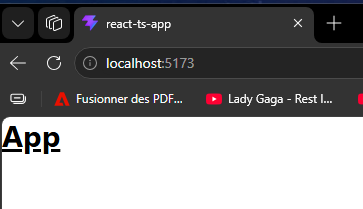
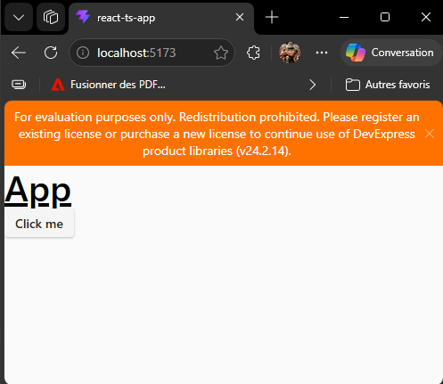

# REACT TypeScript Application

## Initialisation du projet

``` Bash
    npm create vite@latest <project name directory> -- --template react-ts
```

Exemples : pour créer l'application dans le répertoire courant

``` Bash
    npm create vite@latest . -- --template react-ts
```

ou pour créer l'application dans le sous répertoire 'My-React-Project'

``` Bash
    npm create vite@latest My-React-Project -- --template react-ts
```

## Configure VS Code

Ajouter les extensions suivantes :

- ES7 + React/Redux/React-Native snippets (fourni des snippet pour générés les éléments REACT)
- ESLint (Ajoute une configuration supplémentaire à la compilation)
- PostCSS Language Support (Utilisé pour le postcss de tailwind)
- Tailwind CSS IntelliSense (pour l'auto completion dans VS Code lors de l'utilisation de Tailwind CSS)

## Installer stylistic en complément de eslint

- Installer le package

``` bash
npm install @stylistic/eslint-plugin --save-dev
```

- Configurer eslint par le fichier 'eslint.config.js'
  
``` js
import js from '@eslint/js'
import globals from 'globals'
import reactHooks from 'eslint-plugin-react-hooks'
import reactRefresh from 'eslint-plugin-react-refresh'
import tseslint from 'typescript-eslint'
import stylistic from '@stylistic/eslint-plugin' //<-- plugin pour la gestion du point-virgule obligatoire
import { defineConfig, globalIgnores } from 'eslint/config'

export default defineConfig([
  globalIgnores(['dist']),
  {
    plugins: {
      '@stylistic': stylistic //<--- activation du plugin
    },
    files: ['**/*.{ts,tsx}'],
    extends: [
      js.configs.recommended,
      tseslint.configs.recommended,
      reactHooks.configs.flat.recommended,
      reactRefresh.configs.vite,
    ],
    languageOptions: {
      ecmaVersion: 2025,
      globals: globals.browser,
    },
    rules: {                                  //  Ajout des règles
      "no-console": "warn",                   //  Warning s'il reste des console.log dans le code
      "@stylistic/semi": ['error', 'always']  //  Erreur s'il manque des points-virgules
    }                                         //
  },
]);
```

## Ajouter Tailwind

La configuration peut changer attention [TailwindCss](https://tailwindcss.com/docs/installation/using-vite)

- Installer le packager npm

``` bash
    npm install tailwindcss @tailwindcss/vite
```

- Modifier le fichier vite.config.ts

``` TypeScript
import { defineConfig } from 'vite';
import react from '@vitejs/plugin-react';
import tailwindcss from '@tailwindcss/vite'; //<-- ajoouter cette ligne

// https://vite.dev/config/
export default defineConfig({
  plugins: [
    react(),
    tailwindcss() //<-- ajoouter cette ligne
  ],
});
```

- Modifier le fichier index.css en ajoutant ceci en première ligne

``` css
@import "tailwindcss";
```

- Modifier le fichier App.tsx pour tester l'installation

``` TypeScript
const App = () => {
  return (
    <h1 className="text-3xl font-bold underline text-black">App</h1>
  );
};

export default App;
```

Résultat attendu :



## Install DevExtreme

- Installer [DevExtreme](https://js.devexpress.com/React/Documentation/Guide/React_Components/Add_DevExtreme_to_a_React_Application/)

``` bash
npm install devextreme@24.2 devextreme-react@24.2 --save --save-exact
```

- importer le css dans main.tsx

``` TypeScript
import { StrictMode } from 'react';
import { createRoot } from 'react-dom/client';
import './index.css';
import 'devextreme/dist/css/dx.fluent.blue.light.css'; //<-- Cette ligne
import App from './App.tsx';

createRoot(document.getElementById('root')!).render(
  <StrictMode>
    <App />
  </StrictMode>,
)
```

- Tester l'installation avec app.tsx

``` TypeScript
import Button from 'devextreme-react/button';

const App = () => {
    const sayHelloWorld = () => {
        alert('Hello world!');
    };

  return (
    <>
      <h1 className="text-3xl font-bold underline text-black">App</h1>
      <Button text="Click me" onClick={sayHelloWorld} />
    </>
  )
}

export default App
```

Resultat attendu :



## Installer le React-Router-Dom

- Installer le package via npm :
  
``` bash
npm install react-router-dom
```

- Configurer les routes dans main.tsx
  
``` TypeScript
import { StrictMode } from 'react';
import { createRoot } from 'react-dom/client';
import './index.css';
import 'devextreme/dist/css/dx.fluent.blue.light.css';
import App from './App.tsx';
import { createBrowserRouter, RouterProvider } from 'react-router-dom';
import { HomeLayout } from './pages/index.ts';

const router = createBrowserRouter([ 
    { path: '/', element: <HomeLayout />},
    { path: '/test', element: <App />}
  ]);

createRoot(document.getElementById('root')!).render(
  <StrictMode>
    <RouterProvider router={router} />
  </StrictMode>,
);
```

Contenu de index.ts

``` TypeScript
export { default as  HomeLayout } from "./HomeLayout";
```

Contenu de HomeLayout.tsx

``` TypeScript
const HomeLayout = () => {
  return (
    <div>HomeLayout</div>
  );
};

export default HomeLayout;
```
